<p align="center"></p>
The official implementation code of the paper CVPR 2021 paper "Simulating Unknown Target Models for Query-Efficient Black-box Attacks"

By **Chen Ma**, Li Chen, and Jun-Hai Yong.

[[Paper]](https://arxiv.org/abs/2009.00960) [[Slides]](https://raw.githubusercontent.com/machanic/SimulatorAttack/master/paper_material/Slide.pdf) [[中文Slides]](https://raw.githubusercontent.com/machanic/SimulatorAttack/master/paper_material/ChineseSlide.pdf) [[Poster]](https://raw.githubusercontent.com/machanic/SimulatorAttack/master/paper_material/simulator_attack_poster.pdf)

<p align="center"></p>

The procedure of the Simulator Attack, where q1 and q2 are the corresponding perturbations for generating query pairs in the attack. The queries of the first t iterations are fed into the target model to estimate the gradients. These queries and the corresponding outputs are collected to fine-tune the Simulator, which is trained without using the target model. The fine-tuned Simulator can accurately simulate the unknown target model, thereby transferring the queries and improving overall query efficiency. More details can be found in Section 3 of the paper.
# Citation
We kindly ask anybody who uses this code to cite the following bibtex:
```
@InProceedings{ma2021simulator,
    author    = {Ma, Chen and Chen, Li and Yong, Jun-Hai},
    title     = {Simulating Unknown Target Models for Query-Efficient Black-Box Attacks},
    booktitle = {Proceedings of the IEEE/CVF Conference on Computer Vision and Pattern Recognition (CVPR)},
    month     = {June},
    year      = {2021},
    pages     = {11835-11844}
}
```

# Abstract
Many adversarial attacks have been proposed to investigate the security issues of deep neural networks. In the black-box setting, current model stealing attacks train a substitute model to counterfeit the functionality of the target model. However, the training requires querying the target model. Consequently, the query complexity remains high, and such attacks can be defended easily. This study aims to train a generalized substitute model called "Simulator", which can mimic the functionality of any unknown target model. To this end, we build the training data with the form of multiple tasks by collecting query sequences generated during the attacks of various existing networks. The learning process uses a mean square error-based knowledge-distillation loss in the meta-learning to minimize the difference between the Simulator and the sampled networks. The meta-gradients of this loss are then computed and accumulated from multiple tasks to update the Simulator and subsequently improve generalization. When attacking a target model that is unseen in training, the trained Simulator can accurately simulate its functionality using its limited feedback. As a result, a large fraction of queries can be transferred to the Simulator, thereby reducing query complexity. Results of the comprehensive experiments conducted using the CIFAR-10, CIFAR-100, and TinyImageNet datasets demonstrate that the proposed approach reduces query complexity by several orders of magnitude compared to the baseline method. 

# Requirement
Pytorch 1.4.0 or above, torchvision 1.3.0 or above, bidict, pretrainedmodels 0.7.4, opencv-python

# Folder structure
```
+-- configures
|   |-- meta_simulator_attack_conf.json  # the hyperparameters setting of simulator attack
|   |-- Bandits.json  # the hyperparameters setting of Bandits attack
|   |-- prior_RGF_attack_conf.json  # the hyperparameters setting of RGF and P-RGF attack
|   |-- meta_attack_conf.json  # the hyperparameters setting of Meta Attack
|   |-- NES_attack_conf.json  # the hyperparameters setting of NES Attack
|   |-- SWITCH_attack_conf.json  # the hyperparameters setting of SWITCH Attack
+-- dataset
|   |-- standard_model.py  # the wrapper of standard classification networks, and it converts the input image's pixels to the range of 0 to 1 before feeding.
|   |-- defensive_model.py # the wrapper of defensive networks, and it converts the input image's pixels to the range of 0 to 1 before feeding.
|   |-- dataset_loader_maker.py  # it returns the data loader class that includes 1000 attacks images for the experiments.
|   |-- npz_dataset.py  # it is the dataset class that includes 1000 attacks images for the experiments.
|   |-- meta_two_queries_dataset.py  # it is the dataset class that trains the Simulator.
|   |-- meta_img_grad_dataset.py  # it is the dataset class that trains the auto-encoder meta-learner of Meta Attack.
+-- meta_simulator_bandits
|   +-- learning
|       +-- script
|           |-- generate_bandits_training_data_script.py   # it can generate the training data that is generated by using Bandits to attack multiple pre-trained networks.
|       |-- train.py  # the main class for training the Simulator.
|       |-- meta_network.py  # the wrapper class of the meta network, and it can transform any classification network to the meta network in meta-learning.
|       |-- meta_distillation_learner.py  # it includes the main procedure of meta-learning.
|       |-- inner_loop.py  # it includes the inner update of meta-learning.
|   +-- attack
|       |-- meta_model_finetune.py  # it includes the class used for fine-tuning the Simulator in the attack.
|       |-- simulate_bandits_attack_shrink.py  # it includes the main procedure of Simulator Attack.
+-- cifar_models   # this folder includes the target models of CIFAR-10, i.e., PyramidNet-272, GDAS, WRN-28, and WRN-40 networks.
+-- tiny_imagenet_models   # this folder includes the target models of TinyImageNet, e.g., DenseNet and ResNeXT
+-- xxx_attack  # other attacks for the compared experiments in the paper.
|-- config.py   # the main configuration of Simulator Attack, remember to modify PY_ROOT to be the project's folder path in your machine environment.
```

# How to train
## Generate the training data and organize them to the format of multi-tasks.
 (1) Download CIFAR-10, CIFAR-100 and TinyImageNet dataset, including training set and validation set and then extract or unzip the data files. Then, you must modify `IMAGE_DATA_ROOT` variable in `config.py` to the absolute path of the dataset folder.
 
 (2) Generate training data.

 Generate training data of CIFAR-10 dataset by performing **untargeted** Bandits attack under **L2 norm**.

`python of meta_simulator_bandits/learning/script/generate_bandits_training_data_script.py --gpu 0 --dataset CIFAR-10 --batch-size 100 --loss cw --norm l2`

Generate training data of CIFAR-10 dataset by performing **untargeted** Bandits attack under **L∞ norm**.

`python meta_simulator_bandits/learning/script/generate_bandits_training_data_script.py --gpu 0 --dataset CIFAR-10 --batch-size 100 --loss cw --norm linf`

Generate training data of CIFAR-10 dataset by performing **targeted** Bandits attack under **L2 norm**.

`python of meta_simulator_bandits/learning/script/generate_bandits_training_data_script.py --gpu 0 --dataset CIFAR-10 --batch-size 100 --loss cw --norm l2 --targeted`

Generate training data of CIFAR-10 dataset by performing **targeted** Bandits attack under **L∞ norm**.

`python meta_simulator_bandits/learning/script/generate_bandits_training_data_script.py --gpu 0 --dataset CIFAR-10 --batch-size 100 --loss cw --norm linf --targeted`

You can replace CIFAR-10 to CIFAR-100 in command lines to generate the training data of CIFAR-100.

Generate training data of TinyImageNet dataset by performing **untargeted** Bandits attack under **L2 norm**.

`python meta_simulator_bandits/learning/script/generate_bandits_training_data_script.py --gpu 0 --dataset TinyImageNet --batch-size 100 --loss cw --norm l2 --max-queries 10000`

Generate training data of TinyImageNet dataset by performing **untargeted** Bandits attack under **L∞ norm**.

`python meta_simulator_bandits/learning/script/generate_bandits_training_data_script.py --gpu 0 --dataset TinyImageNet --batch-size 100 --loss cw --norm linf --max-queries 10000`

Generate training data of TinyImageNet dataset by performing **targeted** Bandits attack under **L2 norm**.

`python meta_simulator_bandits/learning/script/generate_bandits_training_data_script.py --gpu 0 --dataset TinyImageNet --batch-size 100 --loss cw --norm l2 --targeted --max-queries 10000`

Generate training data of TinyImageNet dataset by performing **targeted** Bandits attack under **L∞ norm**.

`python meta_simulator_bandits/learning/script/generate_bandits_training_data_script.py --gpu 0 --dataset TinyImageNet --batch-size 100 --loss cw --norm linf --targeted --max-queries 10000`

 ## Train the Simulator.

An example of training Simulator using the data generated by performing targeted attack under L2 norm:

`python meta_simulator_bandits/learning/train.py --gpu 0 --arch resnet34 --dataset CIFAR-10 --split_protocol TRAIN_I_TEST_II --load_task_mode NO_LOAD --data_loss_type cw --loss_type mse --adv_norm l2 --targeted`

Explanation: --adv_norm l2 is to use the training data that is generated by performing L2 norm attack

Note that the backbone of defensive models in our paper is ResNet-50. Please add an additional `--without_resnet` to train the Simulator without using resnet-50 network.

## Download the trained model

We provide the trained model in [Tsinghua cloud disk drive](https://cloud.tsinghua.edu.cn/d/a11beb12358b416199b9/) so that you can download. We provide two types of L2 norm models: one is trained on training data with ε=4.6 of L2 norm, and the other is trained on the training data with ε=1.0 in CIFAR-10 and CIFAR-100 dataset, and ε=2.0 in TinyImageNet dataset.


# How to attack

Option 1: attack PyramidNet-272, GDAS, WRN-28, and WRN-40 one by one with one command line.

`python meta_simulator_bandits/attack/simulate_bandits_attack_shrink.py --gpu 0 --norm linf --dataset CIFAR-10 --data_loss cw --distillation_loss mse --meta_arch resnet34 --test_archs`

Option 2: only attack one network, for example the PyramidNet-272.

`python meta_simulator_bandits/attack/simulate_bandits_attack_shrink.py --gpu 0 --norm linf --dataset CIFAR-10 --data_loss cw --distillation_loss mse --meta_arch resnet34 --arch pyramidnet272`

Some examples, attack defensive model of adversarially trained ResNet-50 (AT):

`python meta_simulator_bandits/attack/simulate_bandits_attack_shrink.py --gpu 0 --norm linf --dataset TinyImageNet --data_loss cw --distillation_loss mse --meta_arch resnet34 --arch resnet50 --attack_defense --defense_model adv_train --batch-size 1000 --max-queries 20000`

`python meta_simulator_bandits/attack/simulate_bandits_attack_shrink.py --gpu 0 --norm linf --dataset CIFAR-10 --data_loss cw --distillation_loss mse --meta_arch resnet34 --arch resnet-50 --attack_defense --defense_model adv_train --batch-size 1000 --max-queries 20000`

After typing the command line, a folder named `logs` will be generated. The log and experimental result file (a `.json` file that includes all queries and the success rate) will be saved to the `logs` folder.

# Experiments

## Experimental Setting

<p align="center">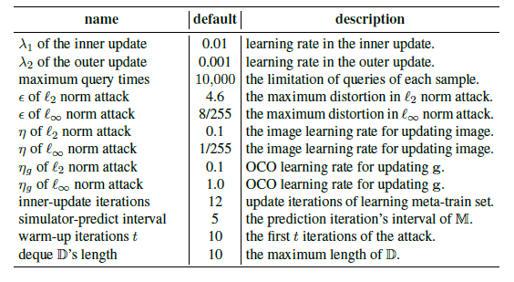</p>

<center>The default parameter setting of Simulator Attack.</center>

<p align="center">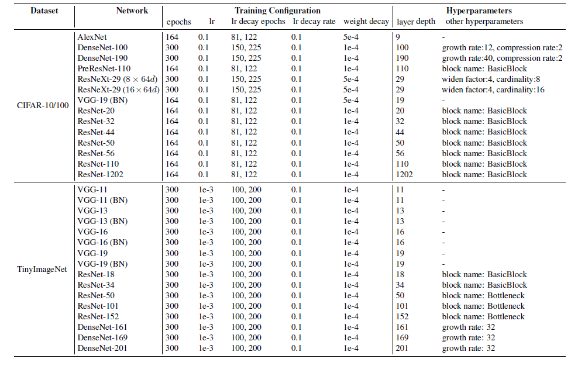</p>

The details of pre-trained classification networks, which are used for the generation of training data in both the Simulator Attack and the Meta Attack. All the data of ResNet networks are excluded in the experiments of attacking defensive models.

## Experimental Results

<p align="center">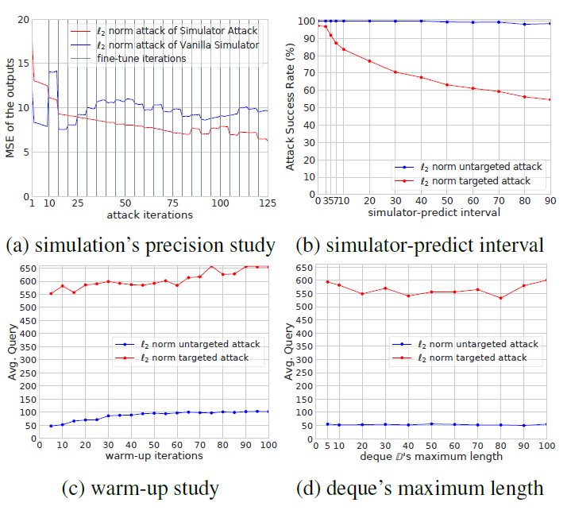</p>

We conduct **ablation studies** of the simulation's precision, simulator-predict interval, warm-up iterations, and deque's maximum length by attacking a WRN-28 model in the CIFAR-10 dataset. The results indicate the following: (1) the meta training is beneficial for achieving an accurate simulation (Fig. a), (2) a difficult attack (e.g., targeted attack) requires a small simulator-predict interval (Fig. b), and (3) more warm-up iterations cause higher average queries (Fig. c).


<p align="center">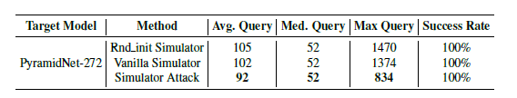</p>

Comparison of different simulators by performing L2 norm attack on the CIFAR-10 dataset. The Rnd\_init Simulator uses an untrained ResNet-34 as the simulator; the Vanilla Simulator uses a ResNet-34 that is trained without using meta-learning as the simulator.

<p align="center">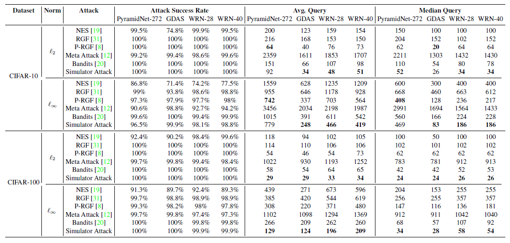</p>

<center>Experimental results of untargeted attack in CIFAR-10 and CIFAR-100 datasets.</center>

<p align="center">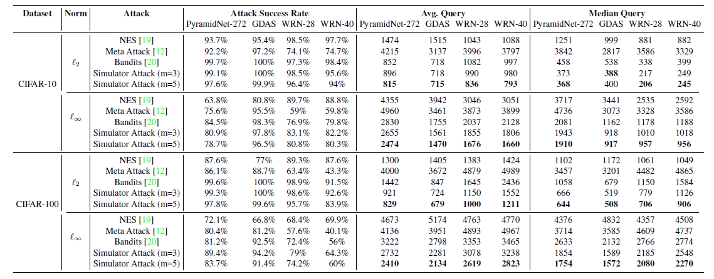</p>

<center>Experimental results of targeted attack in CIFAR-10 and CIFAR-100 datasets.</center>

<p align="center">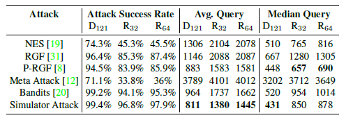</p>

<center>Experimental results of untargeted attack under L∞ norm in TinyImageNet dataset. D121: DenseNet-121, R32: ResNeXt-101 (32 x 4d), R64: ResNeXt-101 (64 x 4d).</center>

<p align="center">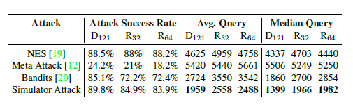</p>

<center>Experimental results of targeted attack under L2 norm in TinyImageNet dataset. D121: DenseNet-121, R32: ResNeXt-101 (32 x 4d), R64: ResNeXt-101 (64 x 4d).</center>

<p align="center">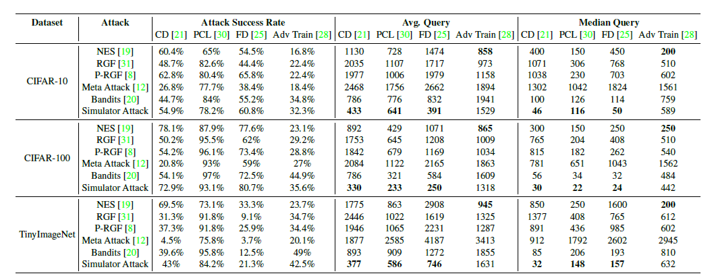</p>

<center>Experimental results after performing the L∞ norm attacks on defensive models, where CD represents ComDefend, FD is Feature Distillation, and PCL is prototype conformity loss.</center>

<p align="center">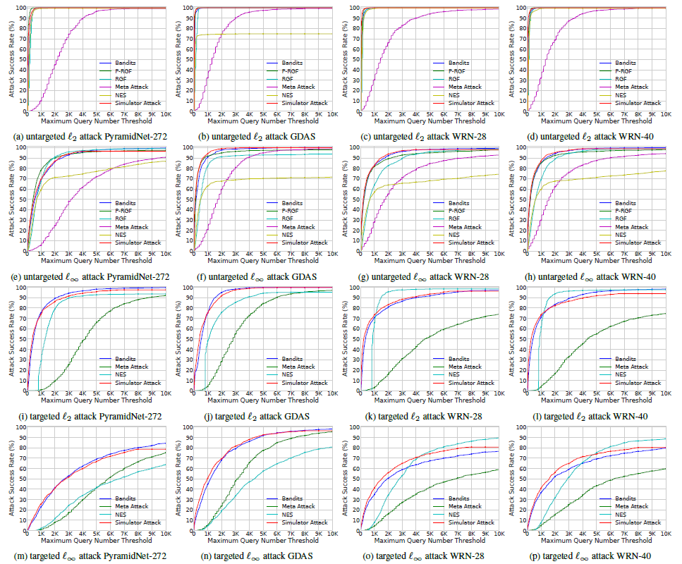</p>

<center>Comparisons of attack success rates at different limited maximum queries in CIFAR-10 dataset.</center>

<p align="center">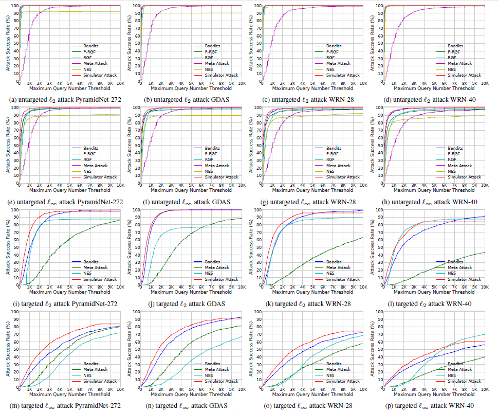</p>

<center>Comparisons of attack success rates at different limited maximum queries in CIFAR-100 dataset..</center>

<p align="center">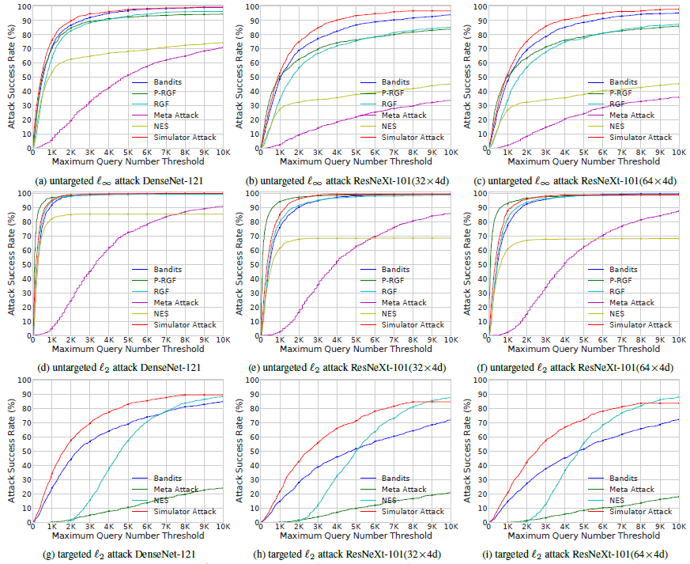</p>

<center>Comparisons of attack success rates at different limited maximum queries in TinyImageNet dataset.</center>

<p align="center">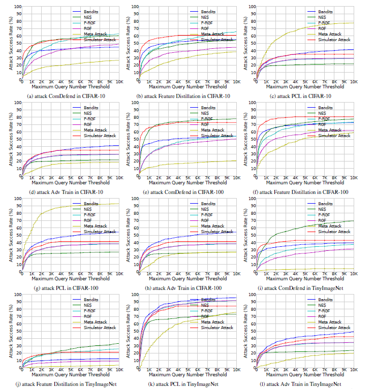</p>

Comparisons of attack success rates at different maximum queries on defensive models with the ResNet-50 backbone. The experimental results are obtained by performing the untargeted attacks under L∞ norm.


